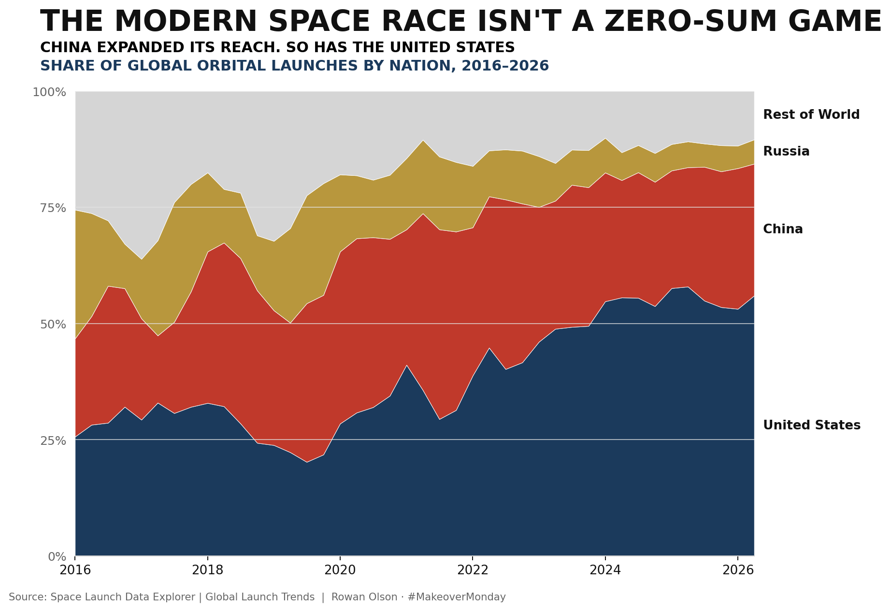
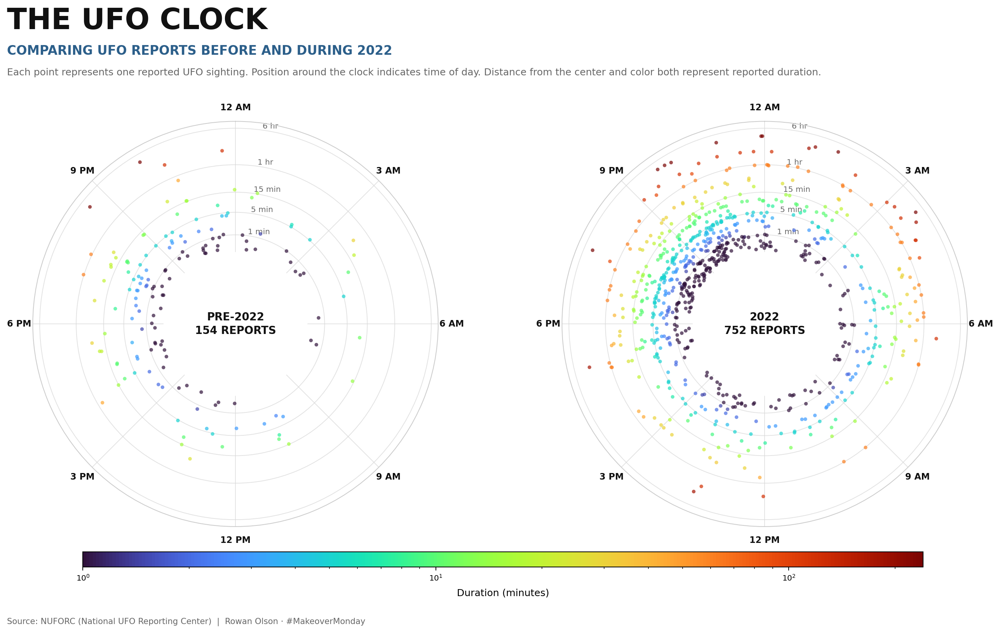
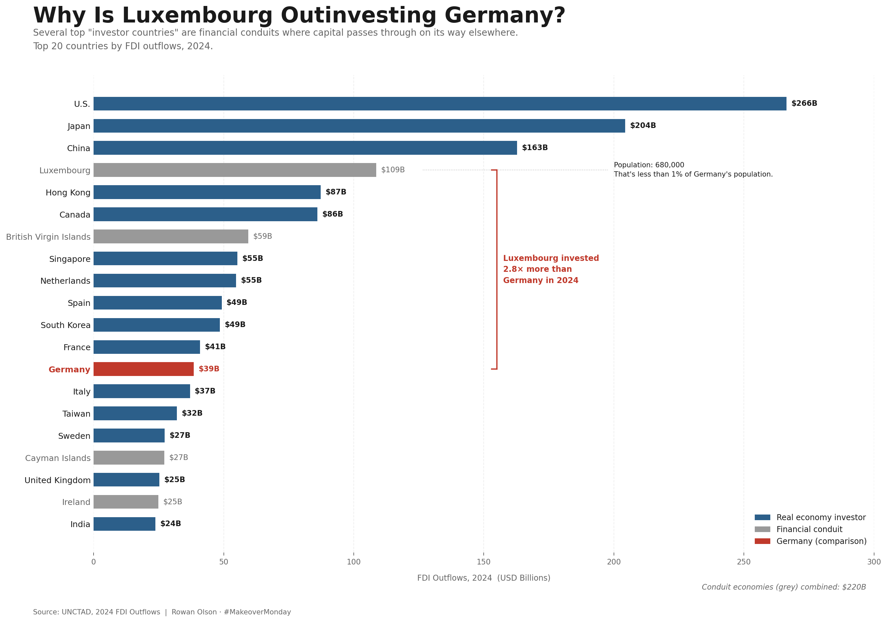
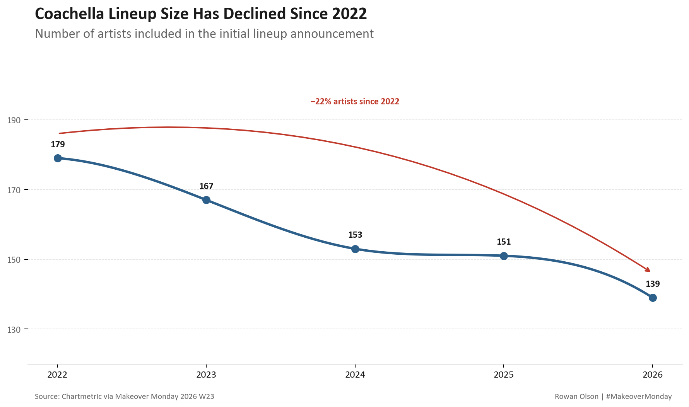
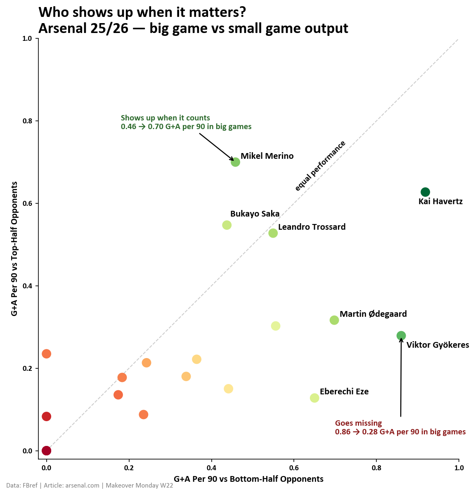
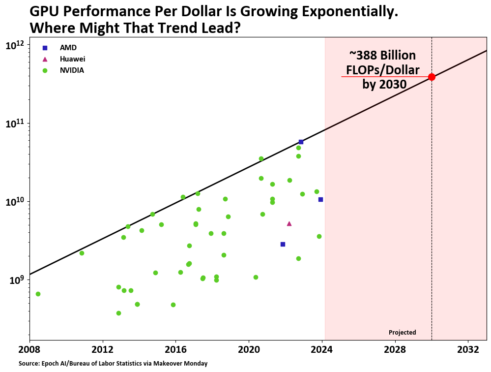
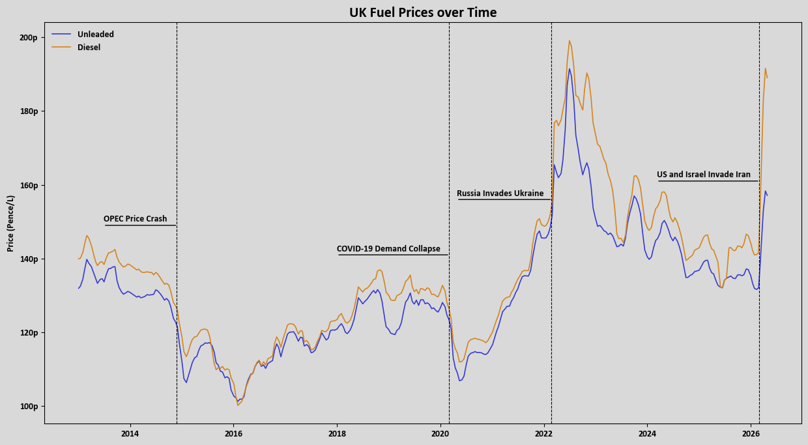

# Makeover Monday Archive, Rowan Olson

## 2026 Week 29 - Data Centers

[View code](datacenters.py) | [Data source](MM2026%20W28%Data%Centers.csv)

## 2026 Week 28 - Park Amenities

[View code](parkamenities.py) | [Data source](MM2026%20W28%Park%20Amenities.csv)

## 2026 Week 27 - Historical Tropical Cyclones

[View code](cyclones.py) | [Data source](MM2026%20W27%20Hist%20Tropical%20Cyclones.csv)

## 2026 Week 26 - Launches

[View code](launches.py) | [Data source](MM2026%20W26%20Launches.csv)

## 2026 Week 25 - UFO Sightings

[View code](ufosightings.py) | [Data source](MM2026%20W25%20UFO%20Sightings.csv)

## 2026 Week 24 - Global Investors

[View code](globalinvestors.py) | [Data source](MM2026%20W24%20Global%20Investors.csv)

## 2026 Week 23 - Coachella Lineup

[View code](coachella.py) | [Data source](MM2026%20W23%20Coachella.csv)

## 2026 Week 22 - Arsenal 2025-26 Season Player Performance

[View code](arsenal.py) | [Data source](MM2026%20W22%20Arsenal.csv)

## 2026 Week 21 - GPU Performance per Dollar

[View code](gpus.py) | [Data source](MM2026%20W21%20GPUs.csv)

## 2026 Week 20 - UK Fuel Prices

[View code](ukfuel.py) | [Data source](MM2026%20W20%20UK%20Fuel.csv)